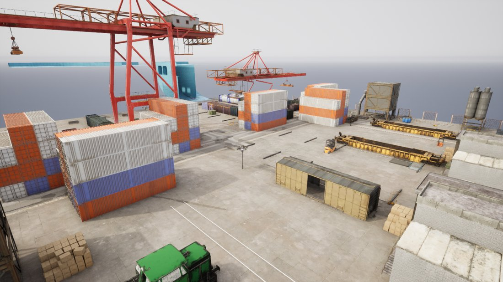
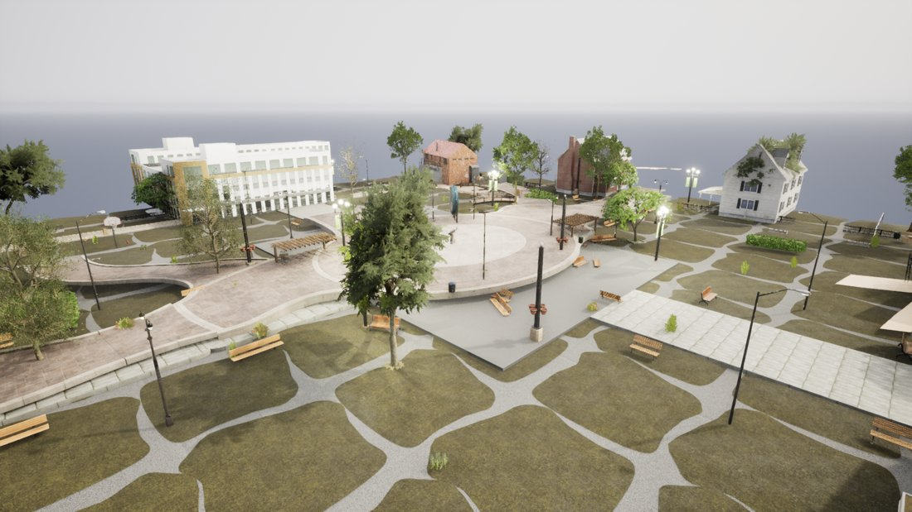
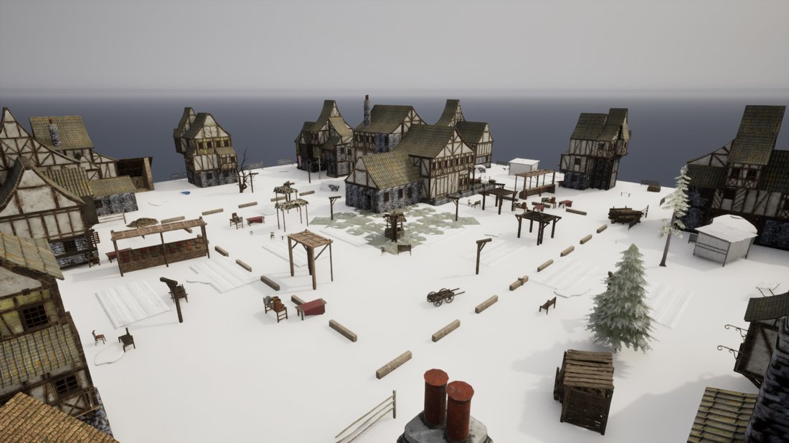
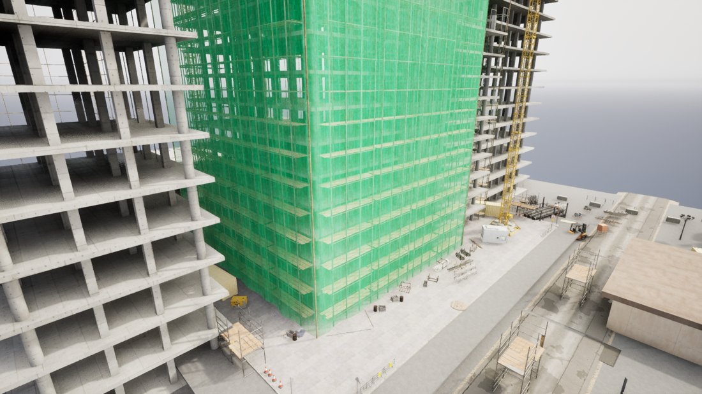
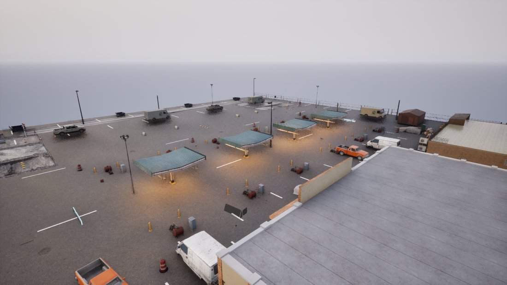

# Asset Retrieval & Scene Generation

SimWorld Studio builds an Unreal Engine scene from a short text prompt. A coding-agent
builder (e.g. codex / gpt-5.5) plans the scene and places assets through MCP tools. On its
own, the builder only reliably knows a small core asset pack — so it tends to reuse the same
generic buildings and miss the thousands of themed, setting-appropriate assets in the project.

The **asset-retrieval pipeline** fixes this: for each prompt it finds the most relevant real
assets from the full library and hands them to the builder, so scenes are built from
setting-appropriate, fully-textured assets with proper ground.

---

## The asset database

A pre-built index of the project's Unreal content (~16k assets across 26 categories):

| Component | Role |
|-----------|------|
| **Catalog** (JSON) | Per-asset metadata: name, category, subcategory, description, tags, scene types, setting, dimensions (w×d×h, m), Unreal path, asset type (Blueprint / static mesh). |
| **Postgres** | Structured + full-text search (`websearch_to_tsquery`), category/setting filtering. |
| **Qdrant** | Dense + sparse vectors for semantic **hybrid** search (RRF fusion). |
| **Embed service** | Encodes queries — dense `BAAI/bge-large-en-v1.5` + sparse `bm25`. |

Configured via env: `ASSET_DB_DIR`, `POSTGRES_URL`, `QDRANT_URL`, `QDRANT_COLLECTION`,
`EMBED_SERVICE_URL`, `PREFILTER_TOP_K`.

---

## Retrieval pipeline (3 stages)

For a given prompt, `asset-retrieval.js` runs:

1. **Route** — an LLM picks the relevant categories for the scene and produces a retrieval
   plan (primary settings, must-have terms, settings to exclude).
2. **Select (per category, in parallel)** — each routed category is **prefiltered** with a
   Qdrant hybrid query (dense + sparse, RRF; Postgres full-text fallback) down to the top
   candidates, then an LLM selects the best ones for the scene.
3. **Aggregate** — a final LLM pass curates a coherent, de-duplicated palette ordered by
   importance.

Robustness built in:
- **Ground guarantee** — a ground/road category is always routed (plus winter snow props for
  winter scenes), so scenes never render on the bare default-grey plane.
- **Non-fatal per-category prefilter** — one off-theme/empty category can't abort the whole
  retrieval; only a true infra outage (every category fails) surfaces an error.
- **Ground-materials fallback** — a curated list of verified ground-surface material paths to
  carpet large areas when no ground *mesh* fits.

---

## Hybrid mode (default): seed + on-demand tool

Earlier the palette was *pushed* as an exclusive list ("build only from these"), which boxed
the builder in: if a category was missing it was stuck, and any junk in the list got placed.
The default mode is now **`hybrid`**, which combines two parts:

**A. Pipeline seed (automatic).** When a build request comes in, the server runs the
retrieval pipeline once and injects the result as a **non-exclusive seed palette** — "lead
with these, but you are not limited to them" — along with **ground-first, setting-matched**
build guidance (grass for a park, snow for winter, sand for a bazaar, cobblestone for a
temple, asphalt for a city/harbor; never water as the floor). VFX / sky-dome / weather /
oversized "background" assets are **filtered out** of the seed so they can't wreck framing.

**B. `search_assets` tool (on demand).** An MCP tool the builder can call mid-build to pull
more relevant assets from the full library — e.g. `search_assets("snow ground tiles")`,
`search_assets("leafy park trees")` — returning real assets with exact spawn paths and
dimensions, so it can fill any gap or add variety beyond the seed.

### Modes

Set per request (`assetRetrievalMode`) or via `ASSET_RETRIEVAL_MODE`:

| Mode | Behavior |
|------|----------|
| `hybrid` *(default)* | Non-exclusive seed palette + `search_assets` tool + ground-first framing + junk filter. |
| `db` | Retrieved palette pushed into the prompt. (`ASSET_DROP_JUNK=1` enables the junk filter here too.) |
| `off` | No retrieval — the builder discovers assets itself via `list_assets` / the content library. |
| `baseline_full` | The entire library, unfiltered, through the same formatter. |

---

## `search_assets` tool

Free-text semantic search over the whole library, exposed to the builder via MCP:

```
search_assets(query: string, category?: string, k?: number)
```

- Hybrid Qdrant query (dense + sparse, RRF) with a Postgres full-text fallback.
- Optional `category` filter (one of the 26 categories); `k` defaults to 12 (max 40).
- Results are junk-filtered and returned with `name`, exact `path`, `spawn_tool`
  (`spawn_blueprint_actor` / `spawn_actor`), `category`, `setting`, `dims`, and `desc`.

Backed by `searchAssets()` in `asset-retrieval-db.js`. The retrieval-stack env is passed
through to the MCP subprocess so the tool works inside the builder's session.

---

## Prompt / build-guidance updates

The instructions injected alongside the palette now emphasize, in order:

1. **Ground first** — carpet the whole ~100×100 m area with a setting-matched ground (tile
   ground/floor meshes edge-to-edge, or a grid of planes with a matching ground material);
   never use water as the floor.
2. **Lead with large / structural assets** (buildings, walls, stalls, big trees, set-pieces)
   as the backbone, reused in rows/clusters distributed across the whole area.
3. **Dense, even fill** (~80–150+ assets) with small props only as light dressing.
4. **Complete, fully-textured assets** only — no floating/half/whitebox placeholders.

---

## Examples

Each scene below was generated in `hybrid` mode from only the short prompt shown.

### Industrial harbor loading dock
> An industrial harbor loading dock with shipping containers, barrels, cranes, warehouse props, pallets, and warning signs.



### Suburban park plaza
> A suburban park plaza with benches, trash bins, trees, planters, playground-like props, street lamps, and path clutter.



### Winter village street
> A winter village street with snow piles, lanterns, bare trees, firewood stacks, market stalls, benches, and fences.



### Construction site
> A construction site with a tower crane, scaffolding, stacked building materials, portable site cabins, fences, barriers, machinery, and debris.



### Roadside gas station & truck stop
> A roadside gas station and truck stop at dusk with fuel pumps, a convenience store, parked trucks, signage, trash bins, and lot markings.


